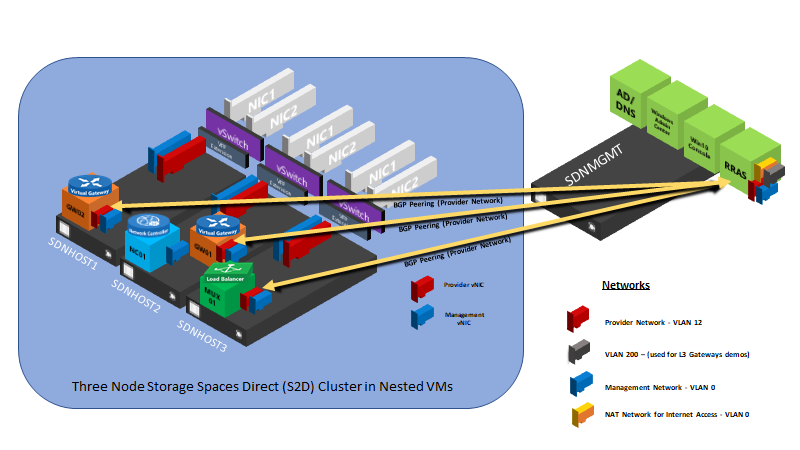

# Hyper-V Sandbox — vMode Edition

**Hyper-V Sandbox — vMode Edition** is a set of PowerShell scripts that build a complete, disposable Windows Server datacenter lab inside nested Hyper-V virtual machines (single-host quick start, scaling up to four physical hosts). Learn and validate modern Windows Server (2025 / vNext) capabilities — **Active Directory, Failover Clustering, SMB & Storage Spaces Direct, Windows Admin Center (including Virtualization Mode / "vMode"), and Software-Defined Networking (SDN)** — without standing up physical servers, switches, or routers.

SDN remains a first-class scenario: the lab supports full Microsoft SDN provisioning (optional, toggled by `ProvisionLegacyNC`) and ships the `SDNEXAMPLES` walkthroughs and `SDNExpress` tooling for operational training and feature validation.

> **History:** Originally created in 2016 to showcase Microsoft SDN, the project has grown into a general-purpose virtualization sandbox. SDN stays front and center while the lab now also surfaces Active Directory, Failover Clustering, Storage/SMB, and Windows Admin Center vMode scenarios.

> **Not a production solution!** These scripts are tuned to run in a limited-resource lab. The environment is not fault tolerant, not highly available, and lacks the performance of a real deployment. Never use it with real credentials or on production networks.

## A note on names

The product is **Hyper-V Sandbox — vMode Edition**, but some internal identifiers keep their historical `SDN` prefix for stability — the VM names (`SDNMGMT`, `SDNHOST1/2`), the `SDN*` configuration keys, and the `SDNSandbox-Config.psd1` filename. The `SDNEXAMPLES` and `SDNExpress` content keeps "SDN" because that is the correct technical term. See [CONTRIBUTING.md](CONTRIBUTING.md) for details.

