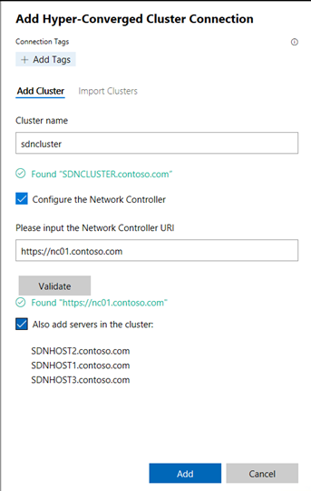

# SDN Sandbox Guide (2/4/2025)

SDN Sandbox is a series of scripts that creates a [HyperConverged](https://docs.microsoft.com/en-us/windows-server/hyperconverged/) environment using three nested Hyper-V Virtual Machines. The purpose of the SDN Sandbox is to provide operational training on Microsoft SDN as well as provide a development environment for DevOPs to assist in the creation and
validation of SDN features without the time consuming process of setting up physical servers and network routers\switches.

>**SDN Sandbox is not a production solution!** SDN Sandbox's scripts have been modified to work in a limited resource environment. Because of this, it is not fault tolerant, is not designed to be highly available, and lacks the nimble speed of a **real** Microsoft SDN deployment.

Also, be aware that SDN Sandbox is **NOT** designed to be managed by System Center Virtual Machine Manager (SCVMM), but by Windows Admin Center. 

## History

SDN Sandbox is a *really* fast refactoring of scripts that I wrote for myself to rapidly create online labs for SDN using SCVMM. This was initially created in 2016 with the most recent being an update in 2025.


## Quick Start (TLDR)

You probably are not going to read the requirements listed below, so here are the steps to get SDN Sandbox up and running on a **single host** :

1. Download and unzip this solution to a drive on a x86 System with at least 64gb of RAM, 2025 (or higher) Hyper-V Installed, and , optionally, a External Switch attached to a network that can route to the Internet and provides DHCP.

2. Create the GUI.vhdx and CORE.vhdx parent images. The easiest way is to run ``.\New-SDNVHDfromISO.ps1`` from an elevated PowerShell console with **no parameters** - it will automatically download the Windows Server 2025 Evaluation ISO, download the latest cumulative update, and build **both** GUI.vhdx (Datacenter Desktop Experience) and CORE.vhdx (Datacenter Core) - fully patched - at the paths defined in the configuration file. (See "Building the VHDX files" below for options such as using your own ISO or offline updates.)

3. Edit the .PSD1 configuration file (do not rename it) to set:
    
    * Product Key for 2025 Datacenter (or just use the provide product key which assumes you have a KMS server to activate the image.  
      
    >**Warning!** The Configuration file will be copied to the console drive during install. **The product keys will be in plain text and not deleted or hidden!**     
    
    * The paths to the VHDX files that you just created.
    * Set ``HostVMPath`` where your VHDX files will reside. (*Ensure that there is at least 250gb of free space!*)
    * Optionally, set the name of your external switch that has access to the internet in the ``natExternalVMSwitchName = `` setting and optionally the VLAN for it in the ``natVLANID``. If you don't want Internet access, set ``natConfigure`` to ``$false``.

4. On the Hyper-V Host, open up a PowerShell console (with admin rights) and navigate to the ``SDNSandbox`` folder and run ``.\New-SDNSandbox``.

7. It should take a up to 2 hours to deploy.

8. Using RDP, log into the Console with your creds: User: Contoso\Administrator Password: Password01

9. Launch the link to Windows Admin Center

10. Add the Hyper-Converged Cluster *SDNCluster* to *Windows Admin Center* with *Network Controller*: [https://nc01.contosoc.com](https://nc01.contosoc.com) and you're off and ready to go!



## Configuration Overview

SDN Sandbox will automatically create and configure the following:

* Active Directory virtual machine
* Windows Admin Center virtual machine
* Routing and Remote Access virtual machine (to emulate a *Top of Rack (ToR)* switch)
* Two node Hyper-V S2D cluster with each having a SET Switch
* Management and Provider VLAN and networks 
* Private, Public, and GRE VIPs automatically configured in Network Controller
* VLAN to provide testing for L3 Gateway Connections


## Hardware Prerequisites

The SDN Sandbox can run on either a single host or up to 4 Hyper-V hosts connected with either a dumb hub, direct connection (between 2 hosts), unmanaged switch, or a managed switch with the VLANs attached trunked to each used port.

|  Number of Hyper-V Hosts | Memory per Host   | HD Available Free Space   | Processor   |  Hyper-V Switch Type |
|---|---|---|---|---|
| 1  | 64gb | 250gb SSD\NVME   | Intel - 4 core Hyper-V Capable with SLAT   | Installed Automatically by Script  |
| 2 |  32gb | 150gb SSD\NVME   | Intel - 4 core Hyper-V Capable with SLAT   | Same Name External Switch on each host  |
| 4  | 16gb | 150gb SSD\NVME   | Intel - 4 core Hyper-V Capable with SLAT   | Same Name External Switch on each host  |


> **WAC Virtualization Mode (vMode):** The lab now provisions an always-on `wacvmode` VM on SDNMGMT, so SDNMGMT uses 32 GB (up from 24 GB) and the host memory reserve is correspondingly higher. Ensure the physical host has headroom for SDNMGMT (32 GB) plus the two SDNHOSTs.


Please note the following regarding the hardware setup requirements:

* It is recommended that you disable all disconnected network adapters or network adapters that will not be used.

* It is **STRONGLY** recommended that you use SSD or NVME drives (especially in single-host). This project has been tested on a single host with four 5400rpm drives in a Storage Spaces pool with acceptable results, but there are no guarantees.

* If using more than one host, an unmanaged switch or dumb hub should be used to link all of the systems together. If a managed switch is used, ensure that the following VLANS are created and trunked to the ports the host(s) will be using:

   * VLAN 12 – **Provider Network**
   * VLAN 200 - **VLAN for L3 testing** (optional)

> **Note:** The VLANs being used can be changed using the configuration file.

>**Note:** If the default Large MTU (Jumbo Frames) value of 9014 is not supported in the switch or NICs in the environment, you may need to set the SDNLABMTU value to 1514 in the SDN-Configuration file.

### NAT Prerequisites

If you wish the environment to have internet access in the Sandbox, create a VMswitch on the FIRST host that maps to a NIC on a network that has internet access the network should use DHCP. The configuration file will need to be updated to include the name of the VMswitch to use for NAT.


## Software Prerequisites

### Required VHDX files:

 **GUI.vhdx** - Sysprepped Desktop Experience version of Windows Server 2025 **Datacenter**. Only Windows Server 2025 Datacenter is supported.           
  
**CORE.vhdx** - Same requirements as GUI.vhdx except the Core installation from the same media that the GUI.VHDX file is placed from.

>**Note:** Product Keys WILL be required to be entered into the Configuration File. If you are using VL media, use the [KMS Client Keys](https://docs.microsoft.com/en-us/windows-server/get-started/kmsclientkeys) keys for the version of Windows you are installing.

### Building the VHDX files (New-SDNVHDfromISO.ps1)

``New-SDNVHDfromISO.ps1`` builds the two parent images and slipstreams the newest Windows updates into them. Because every host and SDN virtual machine in the lab is a Hyper-V differencing child (or a direct copy) of GUI.vhdx / CORE.vhdx, patching these two images is all that is required for **every** VM in the sandbox to be up to date.

> For a full step-by-step runbook (prerequisites, offline builds, verification, and troubleshooting) see [New-SDNVHDfromISO-Instructions.md](./New-SDNVHDfromISO-Instructions.md). The script runs a pre-flight check and stops with a clear message if a prerequisite (elevation, Hyper-V/DISM cmdlets, or free disk space) is missing.

Run from an elevated Windows PowerShell console on the Hyper-V host:

```powershell
# Fully automatic: download eval ISO + latest cumulative update, build both images
.\New-SDNVHDfromISO.ps1
```

Useful parameters:

| Parameter | Default | Description |
|---|---|---|
| ``-VHDType`` | ``Both`` | Build ``GUI``, ``CORE``, or ``Both``. |
| ``-Edition`` | ``Datacenter`` | Windows Server edition to extract (``Datacenter`` or ``Standard``). |
| ``-IsoPath`` | *(none)* | Use a local ISO instead of downloading the evaluation ISO. |
| ``-DownloadISO`` | ``$true`` | Auto-download the evaluation ISO when ``-IsoPath`` is not supplied. |
| ``-DownloadUpdates`` | ``$true`` | Download the latest cumulative update from the Microsoft Update Catalog. |
| ``-UpdatesPath`` | *(none)* | Folder of local ``*.msu`` files to additionally inject (applied in addition to the auto-downloaded CU). |
| ``-VHDSize`` | ``100GB`` | Virtual size of each (dynamic) parent VHDX. |
| ``-WorkPath`` | ``<launchDrive>\SDNVHDBuild`` | Cache folder for the downloaded ISO, updates and DISM scratch (reused across runs). Defaults to the drive the script was launched from, not C:. |
| ``-Parallel`` | *(off)* | Build ``GUI.vhdx`` and ``CORE.vhdx`` concurrently (only when both are selected) to use idle CPU/disk and cut wall-clock time. Trades the per-image live progress bar for periodic heartbeat updates. |

>**Note:** Build artifacts stay on the **drive the script was launched from** by default (not C:). The ISO/updates/scratch go to ``<launchDrive>\SDNVHDBuild`` and the parent images to ``<launchDrive>\SDNVHDs\``. The output paths come from ``guiVHDXPath`` / ``coreVHDXPath`` in ``SDNSandbox-Config.psd1``; if those point at another drive the script re-bases them onto the launch drive and **updates the config in place** (comments preserved) so ``New-SDNSandbox.ps1`` finds the images in the same place.

>**Note:** The auto-downloaded ISO is the Windows Server 2025 **Evaluation** edition (180-day). The VHDX is built natively with in-box Hyper-V and DISM cmdlets, and the latest cumulative update (plus any Server 2025 **checkpoint** update) is downloaded by querying the Microsoft Update Catalog directly - **no third-party PowerShell modules are required**. If the catalog lookup fails, the build retries and then continues with a warning rather than failing - supply ``-UpdatesPath`` to guarantee a specific update is injected.

## Configuration File (NestedSDN-Config) Reference

The following are a list of settings that are configurable and have been fully tested. You may be able to change some of the other settings and have them work, but they have not been fully tested.

>**Note:** Changing the IP Addresses for Management Network (*default of 192.168.1.0/24*) has been succesfully tested.


